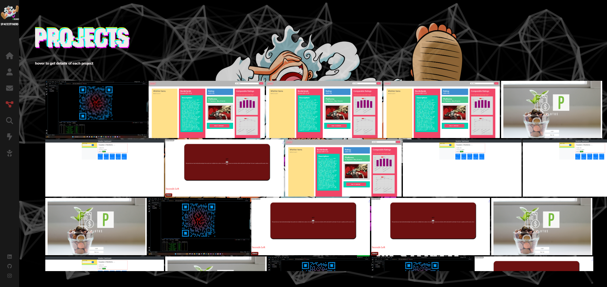

# B-react-portfolio

   
  
   

## Description

 Dedicated entry-level Nondestructive Testing Examiner seeking immediate employment with a company providing long-term opportunities for growth, training, and advancement. Hardworking and passionate job seeker with strong organizational skills eager to secure entry-level software developer position. Ready to help team achieve company goals.

## Table of Contents
*[Title](#title)

*[Description](#description)
    
*[Installation](#installation)   

*[License](#license)
    
*[Questions](#questions)

*[URL](#URL)
    

## Installation

* Clone the GitHub repository to your local machine.
* Ensure you have Node.js installed.
* Execute npm install to install the required dependencies.
* Initiate the web server and establish connection by running npm start.

## License

## badges

             
             

## Questions
Any questions about this project please send me a message on *https://github.com/fordefam12 or email me at [fordefam12@gmail.com]

## URL
  
  

<a href='https://main--brandon-forde-portfolio.netlify.app//'>
CLICK QR CODE for deploy link
</a>

## Screenshots

